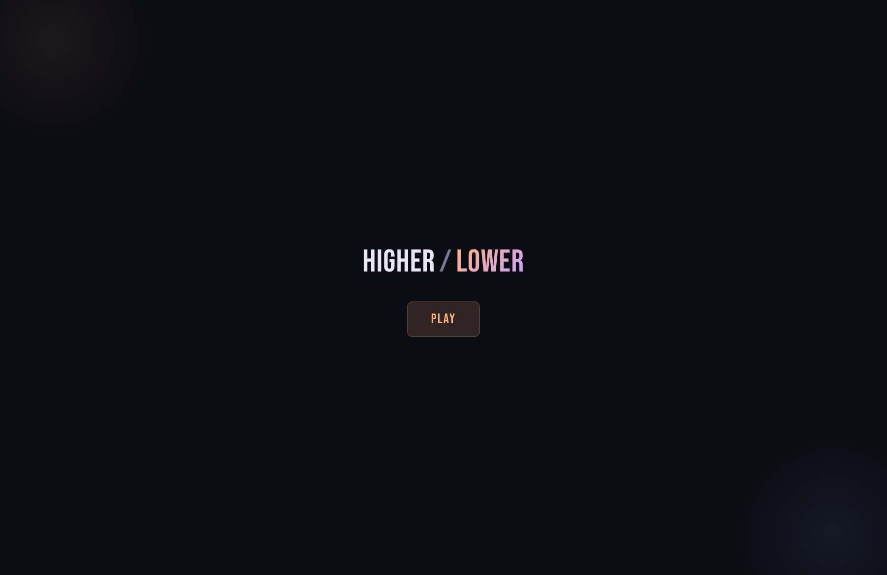
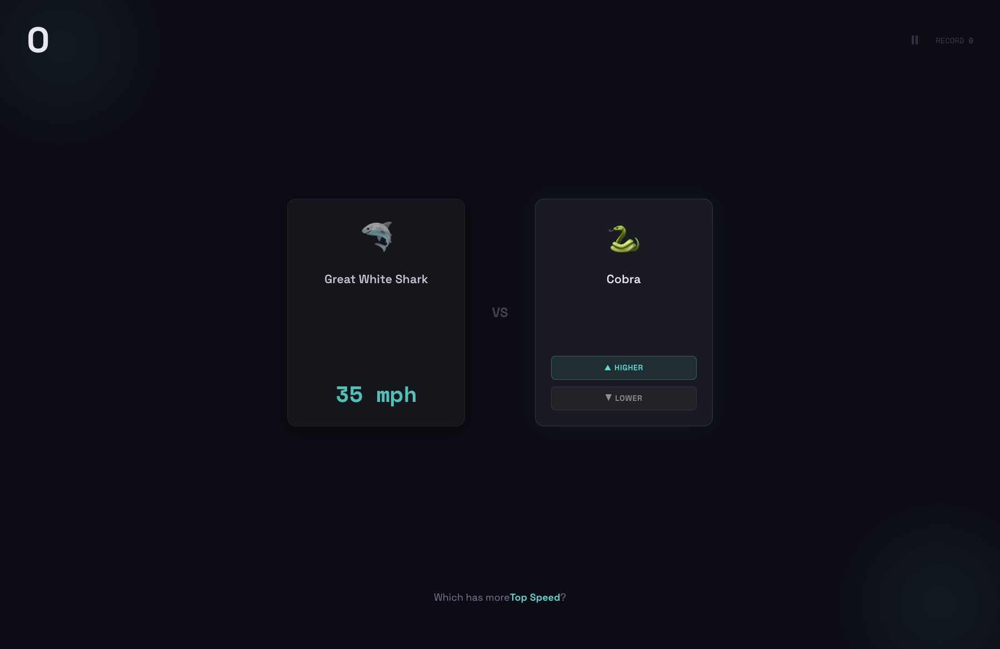
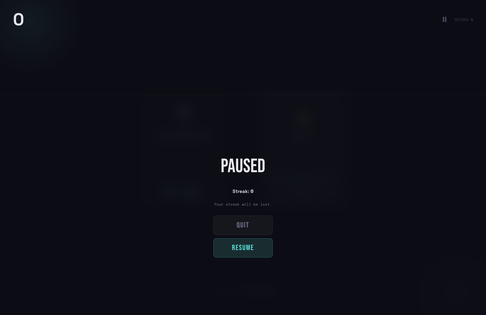
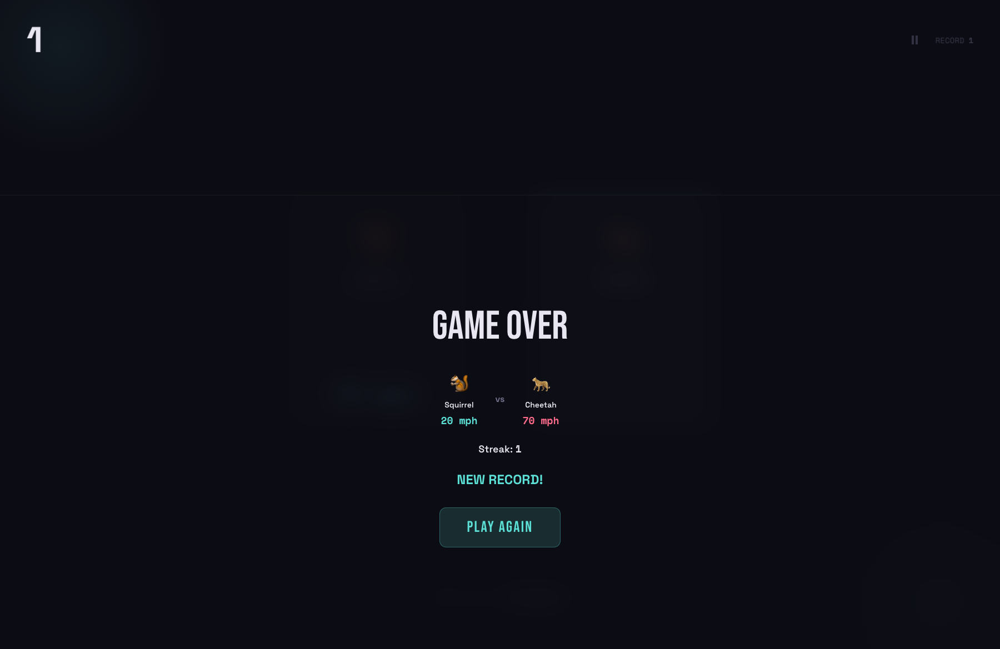

# Higher / Lower

A trivia game where you guess whether one thing is **higher** or **lower** than another. Build your streak, set records, and learn surprising facts along the way.

Built with React, TypeScript, Vite, and Motion.

## Game Flow

### Start Screen

Pick a category and jump in.



### Gameplay

Two items are shown side-by-side. The anchor card reveals its value — guess whether the challenger is **higher** or **lower**.



### Pause

Tap the pause icon in the top bar to take a break. Resume to keep going, or quit back to the start screen (your record is preserved, but the current streak is lost).



### Game Over

Get it wrong and the game ends. See the fatal comparison, your streak, and whether you set a new record.



## Getting Started

```bash
npm install
npm run dev
```

## Tech Stack

- **React 19** + **TypeScript**
- **Vite** for dev/build
- **Motion** (Framer Motion) for animations
- **Tailwind CSS** for utility styles
